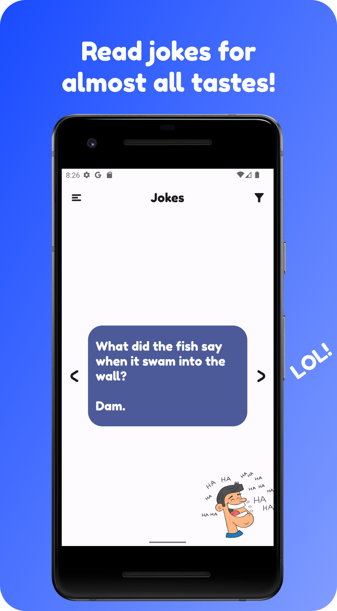
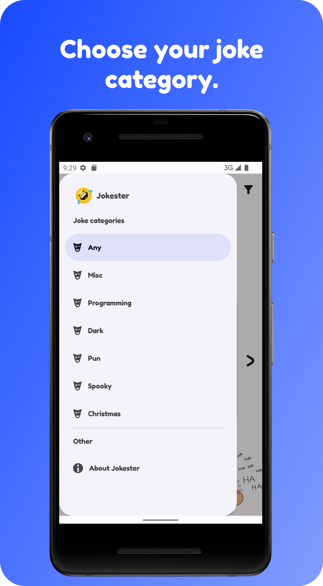
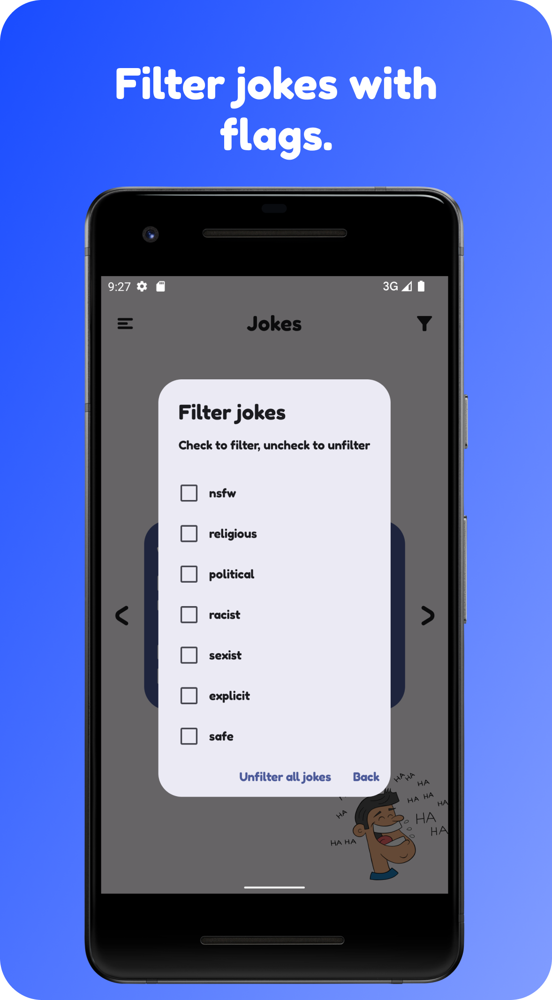

#  Jokester

The app that can make us laugh with its jokes! The android app that shows both dark-ish and more appropriate jokes to everyone. The app that shows jokes, for most tastes!

**WARNING**: Some of the jokes that the app shows, may be offensive for some people. No offense intended. Don't say I didn't warn you. The jokes are there to make us laugh, not offend people. When the 1.0.0-beta releases, it will have an option to show only non-offensive and appropriate jokes for everyone.

## Screenshots

  
  
  

## Latest release
Version 1.0.0 Beta is ready! [Download it](https://github.com/ioannis-xenakis/Jokester/releases/download/v1.0.0-beta/jokester-v1.0.0-beta.apk) and run/open it from your android device.

## Tools/ide used for app development
Built with Android Studio. [Use the stable version](https://developer.android.com/studio) to build with me.

## Become a tester
Jokester is looking for app testers! If you like to be the first to get new features that aint ready yet, come on and join on Google Play store as an alpha tester! You can be beta tester too, if you want. You can also email me new feature ideas on my email at Xenakis.i.contact@gmail.com . Be sure I'll take feature ideas into consideration, if not add them. I would love and appreciate it if you become an alpha/beta tester!  
#### How to become an alpha tester on Google Play Store/Github
You can become an alpha tester by emailing me your email adress which is connected with your Google Play store account, then I'll add you with your email address you sent me, to the testers list and email you the invitation link to the email address you sent me.
Or if you dont want to install Jokester through Google Play Store, and install it from Github, just [head to releases](https://github.com/ioannis-xenakis/Jokester/releases) and  download the latest beta/alpha release.

## Contribute
I would appreciate it a lot to help me build this app and make it better for the people to see and use it.
- If you want, you can just drop some ideas for the app. You can drop your ideas as an "issue" on ["issues" tab](https://github.com/ioannis-xenakis/Jokester/issues), then click on "New issue" and add your idea there.
- Also, if you want to code with me and help, you can create an issue in [issues tab](https://github.com/ioannis-xenakis/Jokester/issues) to tell me what kind of feature/help you want to suggest, then you can fork the project, clone your forked project to your android studio, create a branch from Develop branch, make your changes on the created branch and pull request on my Develop branch. There's a Github official tutorial about [pull requests](https://docs.github.com/en/pull-requests/collaborating-with-pull-requests/proposing-changes-to-your-work-with-pull-requests/creating-a-pull-request-from-a-fork) from your fork to upstream repository(my repository).
Thank you for seeing this!

## License
This app/repo, is licensed under the [GNU General Public License(GPL) Version 3.](LICENSE.md)

## Privacy policy
[This is the privacy policy](PRIVACY_POLICY.md) that specifies what data and if the Jokester app collects personal data.
Also specifies for the permissions that the app requests from you and your android device.

## Contact me
For anything you want, don't hesitate to contact me by email, at: Xenakis.i.contact@gmail.com

## Support me
I would very much appreciate it, if you support me and donate as i don't have any other income at the moment. Any support is appreciated! Thank you, in advance!

  
